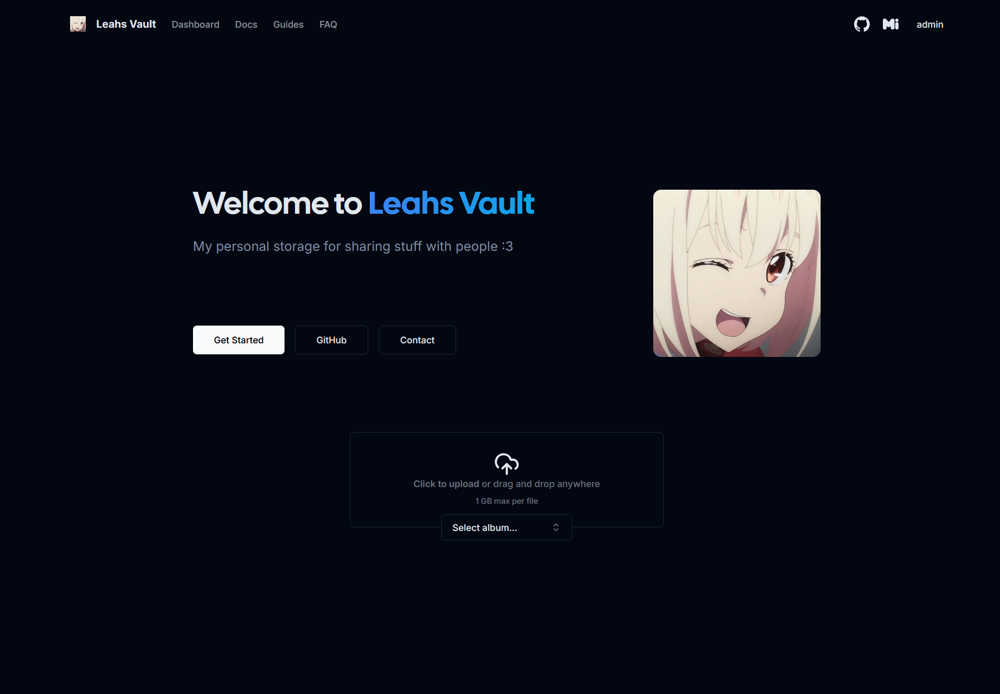

  

## What is Leahsafe?
Leahsafe is a fork of [Chibisafe](https://github.com/chibisafe/chibisafe) adding a few new features and changing some styling 💖

This is more of a personal fork but can be used by others. It may not always be up to date.

### Features of this fork
- ✨ Slightly more sleek home page
- ✉️ Added configurable email contact button

## Installing and running leahsafe
You can follow the docker guide for [chibisafe](https://github.com/chibisafe/chibisafe) or run it manually. If you follow their docker guide please remember to swap out `chibisafe/chibisafe` for `chaoticleah/leahsafe` for both the server and client images

### Screenshots

## Author

**Leahsafe** © [Leah](https://github.com/ChaoticLeah), Released under the [MIT](https://github.com/ChaoticLeah/leahsafe/blob/master/LICENSE) License. 

